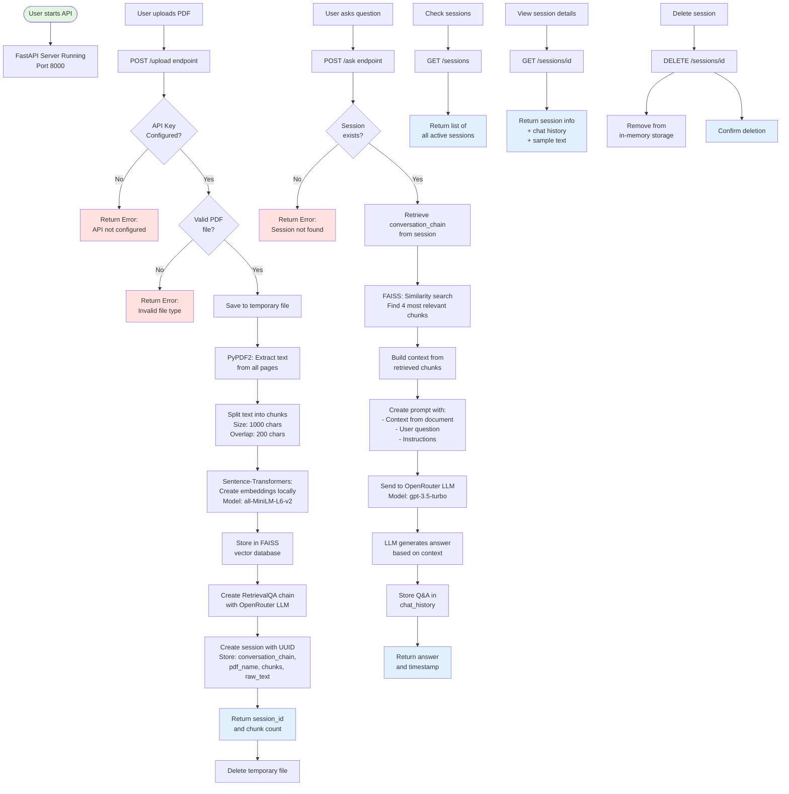

# Chat with PDF - System Flow

This document explains the complete workflow of how the Chat with PDF application processes documents and answers questions.

## 📊 Complete System Flow Diagram



## 🔄 Detailed Step-by-Step Flow

### Phase 1: PDF Upload (`POST /upload`)

1. **Request Received**
   - User sends PDF file via multipart/form-data
   - Endpoint: `/upload`

2. **Validation**
   - Check if OpenRouter API key is configured
   - Verify file has `.pdf` extension

3. **File Processing**
   - Save uploaded file to temporary location
   - Open file with PyPDF2

4. **Text Extraction**
   ```python
   for page in pdf_reader.pages:
       text += page.extract_text()
   ```

5. **Text Chunking**
   - Split text using `RecursiveCharacterTextSplitter`
   - Chunk size: 1000 characters
   - Overlap: 200 characters
   - Result: List of text chunks

6. **Embedding Creation**
   - Use HuggingFace `sentence-transformers`
   - Model: `all-MiniLM-L6-v2`
   - Runs locally on CPU
   - No API calls needed

7. **Vector Storage**
   - Create FAISS vector store
   - Store embeddings for similarity search

8. **Chain Creation**
   - Initialize ChatOpenAI with OpenRouter config
   - Create custom prompt template
   - Build RetrievalQA chain with:
     - LLM: OpenRouter
     - Retriever: FAISS (k=4 chunks)
     - Chain type: "stuff"

9. **Session Creation**
   - Generate UUID for session
   - Store in memory:
     - `conversation_chain`
     - `pdf_name`
     - `num_chunks`
     - `raw_text`
     - `chat_history` (empty array)
     - `created_at` timestamp

10. **Response**
    - Return `session_id` and `num_chunks`
    - Delete temporary file

### Phase 2: Ask Question (`POST /ask`)

1. **Request Received**
   - User sends question + session_id
   - Endpoint: `/ask`

2. **Session Validation**
   - Check if session_id exists
   - Return error if not found

3. **Retrieve Chain**
   - Get `conversation_chain` from session

4. **Similarity Search**
   - FAISS searches for 4 most similar chunks
   - Uses cosine similarity on embeddings

5. **Context Building**
   - Combine retrieved chunks into context string

6. **Prompt Construction**
   ```
   Use the following pieces of context from the document 
   to answer the question at the end.
   
   Context from the document:
   [RETRIEVED CHUNKS]
   
   Question: [USER QUESTION]
   
   Answer based on the document:
   ```

7. **LLM Invocation**
   - Send prompt to OpenRouter
   - Model: `openai/gpt-3.5-turbo` (default)
   - Temperature: 0.7
   - Max tokens: 1000

8. **Answer Generation**
   - LLM generates response based on context

9. **History Storage**
   - Add Q&A to `chat_history` in session

10. **Response**
    - Return answer + timestamp

### Phase 3: Session Management

#### List Sessions (`GET /sessions`)
- Returns array of all active sessions
- Info: session_id, pdf_name, num_chunks, created_at

#### Get Session Details (`GET /sessions/{id}`)
- Returns complete session information
- Includes chat_history and sample_text

#### Delete Session (`DELETE /sessions/{id}`)
- Removes session from memory
- Frees up resources

## 🏗️ Architecture Components

### Core Components

```
┌─────────────────────────────────────────┐
│           FastAPI Server                │
│        (api.py - Port 8000)            │
└─────────────────────────────────────────┘
              │
              ├─── POST /upload
              ├─── POST /ask
              ├─── GET /sessions
              └─── DELETE /sessions/{id}
              
┌─────────────────────────────────────────┐
│         Session Storage                 │
│    (In-Memory Dictionary)               │
│  {session_id: {chain, history, ...}}   │
└─────────────────────────────────────────┘

┌─────────────────────────────────────────┐
│       PDF Processor                     │
│   (utils/pdf_processor.py)             │
├─────────────────────────────────────────┤
│ - load_pdf()                           │
│ - get_text_chunks()                    │
│ - create_vector_store()                │
└─────────────────────────────────────────┘

┌─────────────────────────────────────────┐
│       Chat Handler                      │
│   (utils/chat_handler.py)              │
├─────────────────────────────────────────┤
│ - create_conversation_chain()          │
│ - get_response()                       │
└─────────────────────────────────────────┘

┌─────────────────────────────────────────┐
│       External Services                 │
├─────────────────────────────────────────┤
│ - OpenRouter API (LLM)                 │
│ - HuggingFace Models (Embeddings)      │
└─────────────────────────────────────────┘
```

## 🔐 Data Flow

### Upload Flow
```
User → FastAPI → PyPDF2 → Text Chunker → 
Sentence-Transformers → FAISS → Session Storage → 
Response to User
```

### Question Flow
```
User → FastAPI → Session Lookup → FAISS Search → 
Context Builder → Prompt Template → OpenRouter → 
Answer → Session Update → Response to User
```

## 💾 Session Data Structure

```python
sessions = {
    "session_id_uuid": {
        "conversation_chain": RetrievalQA,  # LangChain chain
        "pdf_name": "document.pdf",         # Original filename
        "num_chunks": 42,                   # Number of chunks
        "raw_text": "Full text...",         # Extracted text
        "created_at": "2025-12-30T...",    # ISO timestamp
        "chat_history": [                   # Q&A history
            {
                "question": "What is this about?",
                "answer": "This document discusses...",
                "timestamp": "2025-12-30T..."
            }
        ]
    }
}
```

## 🎯 Key Technologies Explained

### FAISS (Vector Search)
- **Purpose**: Fast similarity search
- **How**: Compares embedding vectors
- **Why**: Finds relevant PDF chunks for questions
- **Speed**: O(log n) search time

### Sentence Transformers
- **Purpose**: Create text embeddings
- **Model**: all-MiniLM-L6-v2
- **Runs**: Locally on CPU
- **Why**: Free, no API calls

### RetrievalQA Chain
- **Type**: "stuff" (all context in one prompt)
- **Components**: 
  - Retriever (FAISS)
  - LLM (OpenRouter)
  - Prompt Template
- **Flow**: Question → Retrieve → Stuff → Generate

### OpenRouter
- **Purpose**: LLM API gateway
- **Models**: Multiple providers
- **Default**: gpt-3.5-turbo
- **Why**: Flexible, multi-model access

## 🚀 Performance Characteristics

- **PDF Upload**: ~2-5 seconds (depends on size)
- **First Embedding**: ~1-2 seconds (model download)
- **Subsequent Embeddings**: ~0.5-1 second
- **Question Processing**: ~1-3 seconds (LLM latency)
- **Storage**: In-memory (lost on restart)

## 🔍 Debugging Flow

1. Check session details: `GET /sessions/{id}`
2. Verify `num_chunks > 0`
3. Check `sample_text` extraction
4. Review `chat_history` for patterns
5. Test with `test_pdf_context.py`

---

**This flow ensures accurate, context-based answers from your PDFs!** 📄✨
